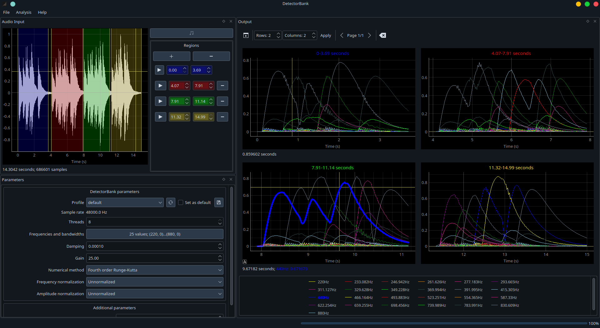

# DetectorBank GUI

| 
|:--:|
| *DetectorBank GUI* |

This app is designed to be a simple visualizer for the 
[DetectorBank](https://keziah55.github.io/DetectorBank/).
You can load an audio file, select frequencies to look for and 
then see where these frequencies are detected in the audio.

See the [Installation instructions](installation.md) for details on how to set up,
then the [User Guide](user_guide.md) for an overview of using the app.
